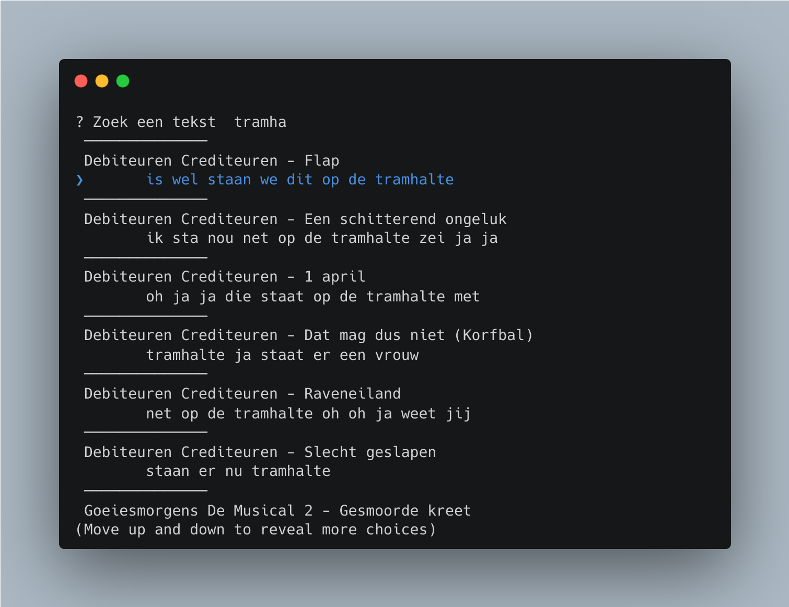

# Wat is dit

Dit is een simpele cli tool om Jiskefet* teksten te zoeken op Youtube. Om vervolgens dit fragment te openen in de browser




# Hoe installeer ik het

Zorg dat Nodejs geinstalleerd is. 

Installeer daarna
```bash
npm i -g jiskefet
```

# Gebruik

Typ daarna ```jiskefet``` in. 
Zoek met een tekst en selecteer met de pijltjes.

* Jiskefet: Dit product is niet van Jiskefet zelf en heeft geen commercieel doel.